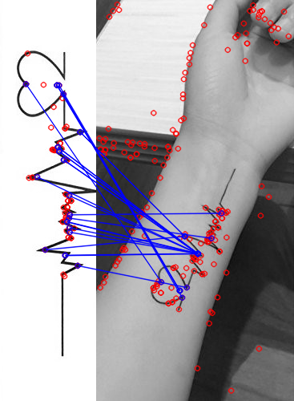
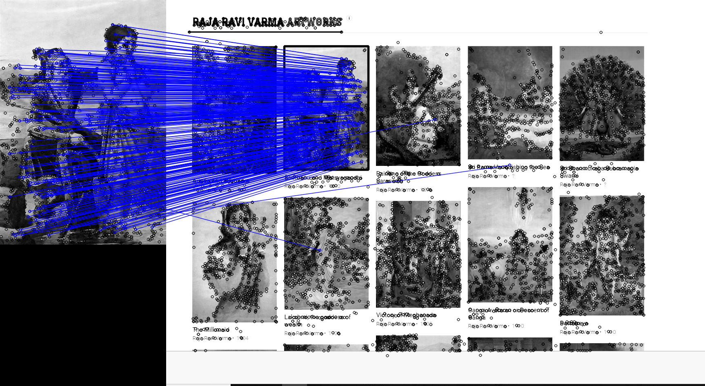

# Image Matching with OpenCV 4 and Python

In this repo, I created a Python script which matches two images using different feature descriptor algorithms like **SIFT**, **SURF**, and **ORB**. 
Then, we use image matching techniques like **Brute-Force**, **Brute-Force-KNN**, and **FLANN** to match the features from the images.
Also, we use homography process to extract out the matched image.

## How To Use
Fork this repo in your working directory and run the <code> matching.py </code> script as follows:
<pre>
<code>
python3 matching.py --logo 'Image to be matched' --image 'Image containing other image' [ --match 'Mathcing technique to be used']
</code>
</pre>

The following matching algorithms can be used:
- Brute-Force (B) 
- Brute-Force-KNN (K)
- FLANN (F)
- Homography with FLANN (H)
- RanSaC (R)

## Example - 1 : Finding a Tattoo

## Example - 2: Matching a painting from many

**NOTE: I've also added a PDF file on finding homography in images**
